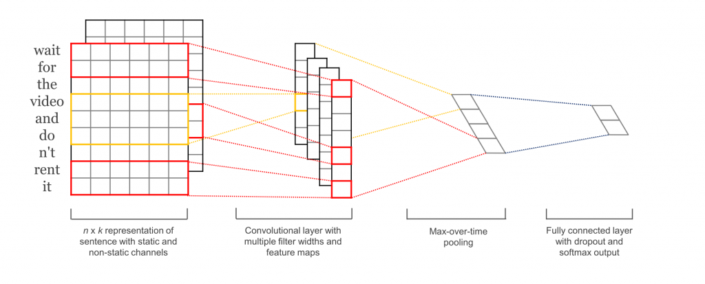
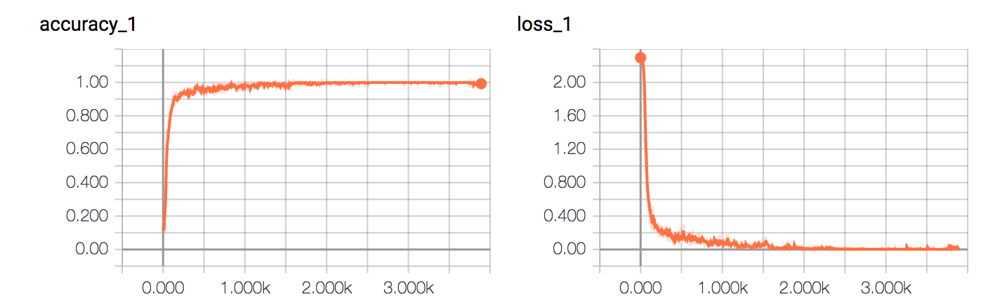

# Text Classification with CNN

使用卷积神经网络进行文本分类

CNN做句子分类的论文可以参看: [Convolutional Neural Networks for Sentence Classification](https://arxiv.org/abs/1408.5882)

还可以去读dennybritz大牛的博客：[Implementing a CNN for Text Classification in TensorFlow](http://www.wildml.com/2015/12/implementing-a-cnn-for-text-classification-in-tensorflow/)

本文是基于TensorFlow在中文数据集上的另一种实现，如果你觉得对你有帮助，欢迎star与交流。

## 环境

- Python 3.5
- TensorFlow 1.3

## 数据集

使用THUCNews的一个子集进行训练与测试，数据集请自行到[THUCTC：一个高效的中文文本分类工具包](http://thuctc.thunlp.org/)下载，请遵循数据提供方的开源协议。

本次训练使用了其中的10个分类，每个分类6500条数据。

类别如下：

```
体育, 财经, 房产, 家居, 教育, 科技, 时尚, 时政, 游戏, 娱乐
```

数据集划分如下：

- 训练集: 5000*10
- 验证集: 500*10
- 测试集: 1000*10

从原数据集生成子集的过程请参看`helper`下的两个脚本。其中，`copy_data.sh`用于从每个分类拷贝6500个文件，`cnews_group.py`用于将多个文件整合到一个文件中。执行该文件后，得到三个数据文件：

- cnews.train.txt: 训练集(50000条)
- cnews.val.txt: 验证集(5000条)
- cnews.test.txt: 测试集(10000条)

## 预处理

`data/cnews_loader.py`为数据的预处理文件。

- `read_file()`：读取上一部分生成的数据文件，将内容和标签分开返回;
- `_build_vocab()`: 构建词汇表，这里不需要对文档进行分词，单字的效果已经很好，这一函数会将词汇表存储下来，避免每一次重复处理;
- `_read_vocab()`: 读取上一步存储的词汇表，转换为`{词：id}`表示;
- `_read_category()`: 将分类目录固定，转换为`{类别: id}`表示;
- `_file_to_ids()`: 基于上面定义的函数，将数据集从文字转换为id表示;
- `to_words()`: 将一条由id表示的数据重新转换为文字;
- `preocess_file()`: 一次性处理所有的数据并返回;
- `batch_iter()`: 为神经网络的训练准备批次的数据。


经过数据预处理，数据的格式如下：

| Data | Shape | Data | Shape |
| :---------- | :---------- | :---------- | :---------- |
| x_train | [50000, 600] | y_train | [50000, 10] |
| x_val | [5000, 600] | y_val | [5000, 10] |
| x_test | [10000, 600] | y_test | [10000, 10] |

## 配置项

可配置的参数如下所示，在`model.py`的上部。

```
class TCNNConfig(object):
    """配置参数"""

    # 模型参数
    embedding_dim = 64      # 词向量维度
    seq_length = 600        # 序列长度
    num_classes = 10        # 类别数
    num_filters = 256       # 卷积核数目
    kernel_size = 5         # 卷积核尺寸
    vocab_size = 5000       # 词汇表达小

    hidden_dim = 128        # 全链接层神经元

    dropout_keep_prob = 0.8 # dropout保留比例
    learning_rate = 1e-3    # 学习率

    batch_size = 128         # 每批训练大小
    num_epochs = 10          # 总迭代轮次
```

## 模型

原始的模型如下图所示：



可看到它使用了多个不同宽度的卷积核然后将它们做了一个max over time pooling转换为一个长的特征向量，再使用softmax进行分类。

实验发现，简单的cnn也能达到较好的效果。

因此在这里使用的是简化版的结构，具体参看`model.py`。

首先在初始化时，需要定义两个`placeholder`作为输入输出占位符。

```
def __init__(self, config):
      self.config = config

      self.input_x = tf.placeholder(tf.int32,
          [None, self.config.seq_length], name='input_x')
      self.input_y = tf.placeholder(tf.float32,
          [None, self.config.num_classes], name='input_y')

      self.cnn()
```

词嵌入将词的id映射为词向量表示，embedding层会在训练时更新。

```
def input_embedding(self):
    """词嵌入"""
    with tf.device('/cpu:0'):
        embedding = tf.get_variable('embedding',
            [self.config.vocab_size, self.config.embedding_dim])
        _inputs = tf.nn.embedding_lookup(embedding, self.input_x)
    return _inputs
```

cnn模型中，首先定义一个一维卷积层，再使用`tf.reduce_max`实现global max pooling。再接两个dense层分别做映射和分类。使用交叉熵损失函数，Adam优化器，并且计算准确率。这里有许多参数可调，大部分可以通过调整TCNNConfig类即可。

```
def cnn(self):
      """cnnc模型"""
      embedding_inputs = self.input_embedding()

      with tf.name_scope("cnn"):
          # cnn 与全局最大池化
          conv = tf.layers.conv1d(embedding_inputs,
              self.config.num_filters,
              self.config.kernel_size, name='conv')

          # global max pooling
          gmp = tf.reduce_max(conv, reduction_indices=[1], name='gmp')

      with tf.name_scope("score"):
          # 全连接层，后面接dropout以及relu激活
          fc = tf.layers.dense(gmp, self.config.hidden_dim, name='fc1')
          fc = tf.contrib.layers.dropout(fc,
              self.config.dropout_keep_prob)
          fc = tf.nn.relu(fc)

          # 分类器
          self.logits = tf.layers.dense(fc, self.config.num_classes,
              name='fc2')
          self.pred_y = tf.nn.softmax(self.logits)

      with tf.name_scope("loss"):
          # 损失函数，交叉熵
          cross_entropy = tf.nn.softmax_cross_entropy_with_logits(
              logits=self.logits, labels=self.input_y)
          self.loss = tf.reduce_mean(cross_entropy)

      with tf.name_scope("optimize"):
          # 优化器
          optimizer = tf.train.AdamOptimizer(
              learning_rate=self.config.learning_rate)
          self.optim = optimizer.minimize(self.loss)

      with tf.name_scope("accuracy"):
          # 准确率
          correct_pred = tf.equal(tf.argmax(self.input_y, 1),
              tf.argmax(self.pred_y, 1))
          self.acc = tf.reduce_mean(tf.cast(correct_pred, tf.float32))
```

## 训练与验证

这一部分详见代码，具体不在此叙述。

在设定迭代轮次为10的时候，测试集达到了96.67%的准确率，可见效果还是很理想的。

```
Loading data...
Time usage: 0:00:16
Constructing Model...
Training and evaluating...
Iter:      1, Train Loss:    2.3, Train Acc:  10.16%, Val Loss:    2.3, Val Acc:  10.54%, Time: 0:00:01
Iter:    201, Train Loss:   0.24, Train Acc:  91.41%, Val Loss:   0.43, Val Acc:  87.94%, Time: 0:00:10
Iter:    401, Train Loss:  0.075, Train Acc:  96.88%, Val Loss:   0.29, Val Acc:  91.54%, Time: 0:00:20
Iter:    601, Train Loss:    0.1, Train Acc:  96.88%, Val Loss:   0.26, Val Acc:  92.32%, Time: 0:00:29
Iter:    801, Train Loss:   0.13, Train Acc:  92.97%, Val Loss:   0.26, Val Acc:  92.82%, Time: 0:00:38
Iter:   1001, Train Loss:  0.098, Train Acc:  95.31%, Val Loss:   0.22, Val Acc:  93.36%, Time: 0:00:47
Iter:   1201, Train Loss:  0.025, Train Acc:  98.44%, Val Loss:   0.21, Val Acc:  93.42%, Time: 0:00:56
Iter:   1401, Train Loss: 0.0046, Train Acc: 100.00%, Val Loss:   0.18, Val Acc:  94.60%, Time: 0:01:05
Iter:   1601, Train Loss:  0.031, Train Acc:  99.22%, Val Loss:   0.19, Val Acc:  94.68%, Time: 0:01:14
Iter:   1801, Train Loss:  0.018, Train Acc:  99.22%, Val Loss:    0.2, Val Acc:  94.30%, Time: 0:01:23
Iter:   2001, Train Loss: 0.0069, Train Acc: 100.00%, Val Loss:   0.21, Val Acc:  94.10%, Time: 0:01:33
Iter:   2201, Train Loss: 0.0035, Train Acc: 100.00%, Val Loss:   0.21, Val Acc:  94.70%, Time: 0:01:42
Iter:   2401, Train Loss: 0.0079, Train Acc: 100.00%, Val Loss:   0.22, Val Acc:  93.86%, Time: 0:01:51
Iter:   2601, Train Loss: 0.0034, Train Acc: 100.00%, Val Loss:   0.22, Val Acc:  94.46%, Time: 0:02:00
Iter:   2801, Train Loss: 0.00073, Train Acc: 100.00%, Val Loss:   0.24, Val Acc:  93.76%, Time: 0:02:09
Iter:   3001, Train Loss: 0.0026, Train Acc: 100.00%, Val Loss:   0.23, Val Acc:  94.22%, Time: 0:02:18
Iter:   3201, Train Loss: 0.0012, Train Acc: 100.00%, Val Loss:   0.22, Val Acc:  94.68%, Time: 0:02:27
Iter:   3401, Train Loss: 0.0025, Train Acc: 100.00%, Val Loss:   0.22, Val Acc:  94.52%, Time: 0:02:36
Iter:   3601, Train Loss: 0.0016, Train Acc: 100.00%, Val Loss:   0.23, Val Acc:  94.92%, Time: 0:02:45
Iter:   3801, Train Loss: 0.0052, Train Acc: 100.00%, Val Loss:   0.31, Val Acc:  93.30%, Time: 0:02:54
Evaluating on test set...
Test Loss:   0.15, Test Acc:  96.67%
```

准确率和误差如图所示：




## RNN

RNN模型，在100轮迭代后，得到了95.38%的准确率，且速度相对CNN要慢很多。

```
Loading data...
Using RNN model...
Time usage: 0:00:17
Constructing TensorFlow Graph...
Generating batch...
Training and evaluating...
Iter:      1, Train Loss:    2.3, Train Acc:  10.94%, Val Loss:    2.3, Val Acc:   8.34%, Time: 0:00:08
Iter:    201, Train Loss:   0.47, Train Acc:  85.94%, Val Loss:   0.61, Val Acc:  82.70%, Time: 0:02:18
Iter:    401, Train Loss:   0.18, Train Acc:  92.97%, Val Loss:   0.46, Val Acc:  86.88%, Time: 0:04:28
Iter:    601, Train Loss:   0.21, Train Acc:  95.31%, Val Loss:   0.45, Val Acc:  87.08%, Time: 0:06:37
Iter:    801, Train Loss:   0.16, Train Acc:  95.31%, Val Loss:    0.4, Val Acc:  89.50%, Time: 0:08:47
Iter:   1001, Train Loss:   0.24, Train Acc:  91.41%, Val Loss:   0.41, Val Acc:  90.04%, Time: 0:10:56
Iter:   1201, Train Loss:  0.041, Train Acc:  99.22%, Val Loss:   0.43, Val Acc:  89.50%, Time: 0:13:05
Iter:   1401, Train Loss:    0.1, Train Acc:  96.09%, Val Loss:   0.33, Val Acc:  90.78%, Time: 0:15:14
Iter:   1601, Train Loss:   0.12, Train Acc:  96.88%, Val Loss:   0.37, Val Acc:  91.18%, Time: 0:17:23
Iter:   1801, Train Loss:   0.11, Train Acc:  96.88%, Val Loss:   0.35, Val Acc:  91.54%, Time: 0:19:32
Iter:   2001, Train Loss:  0.055, Train Acc:  98.44%, Val Loss:   0.35, Val Acc:  91.76%, Time: 0:21:41
Iter:   2201, Train Loss:   0.24, Train Acc:  93.75%, Val Loss:    0.4, Val Acc:  89.98%, Time: 0:23:49
Iter:   2401, Train Loss:  0.073, Train Acc:  97.66%, Val Loss:   0.37, Val Acc:  90.32%, Time: 0:25:57
Iter:   2601, Train Loss:  0.029, Train Acc:  99.22%, Val Loss:   0.46, Val Acc:  88.62%, Time: 0:28:05
Iter:   2801, Train Loss:  0.013, Train Acc: 100.00%, Val Loss:   0.52, Val Acc:  88.18%, Time: 0:30:13
Iter:   3001, Train Loss:  0.033, Train Acc:  99.22%, Val Loss:   0.38, Val Acc:  90.88%, Time: 0:32:19
Iter:   3201, Train Loss:  0.017, Train Acc: 100.00%, Val Loss:   0.42, Val Acc:  89.72%, Time: 0:34:25
Iter:   3401, Train Loss:  0.045, Train Acc:  99.22%, Val Loss:   0.46, Val Acc:  89.38%, Time: 0:36:31
Iter:   3601, Train Loss:  0.027, Train Acc:  99.22%, Val Loss:   0.43, Val Acc:  89.10%, Time: 0:38:37
Iter:   3801, Train Loss:  0.017, Train Acc: 100.00%, Val Loss:   0.43, Val Acc:  89.18%, Time: 0:40:43
Iter:   4001, Train Loss:  0.033, Train Acc:  98.44%, Val Loss:   0.51, Val Acc:  88.56%, Time: 0:42:49
Iter:   4201, Train Loss:  0.098, Train Acc:  96.88%, Val Loss:   0.48, Val Acc:  88.64%, Time: 0:44:55
Iter:   4401, Train Loss:  0.011, Train Acc: 100.00%, Val Loss:   0.47, Val Acc:  89.92%, Time: 0:47:01
Iter:   4601, Train Loss:  0.033, Train Acc:  98.44%, Val Loss:   0.35, Val Acc:  92.02%, Time: 0:49:06
Iter:   4801, Train Loss: 0.0057, Train Acc: 100.00%, Val Loss:   0.47, Val Acc:  89.74%, Time: 0:51:12
Iter:   5001, Train Loss:  0.037, Train Acc:  98.44%, Val Loss:   0.41, Val Acc:  90.30%, Time: 0:53:18
Iter:   5201, Train Loss:  0.012, Train Acc:  99.22%, Val Loss:   0.44, Val Acc:  90.36%, Time: 0:55:24
Iter:   5401, Train Loss:  0.016, Train Acc: 100.00%, Val Loss:   0.45, Val Acc:  90.80%, Time: 0:57:31
Iter:   5601, Train Loss:  0.016, Train Acc: 100.00%, Val Loss:   0.49, Val Acc:  89.74%, Time: 0:59:37
Iter:   5801, Train Loss:  0.029, Train Acc:  99.22%, Val Loss:   0.49, Val Acc:  90.24%, Time: 1:01:43
Iter:   6001, Train Loss: 0.0023, Train Acc: 100.00%, Val Loss:    0.5, Val Acc:  90.30%, Time: 1:03:49
Iter:   6201, Train Loss:  0.058, Train Acc:  98.44%, Val Loss:   0.57, Val Acc:  88.82%, Time: 1:05:55
Iter:   6401, Train Loss:  0.042, Train Acc:  99.22%, Val Loss:   0.54, Val Acc:  89.36%, Time: 1:08:01
Iter:   6601, Train Loss:  0.017, Train Acc:  99.22%, Val Loss:   0.56, Val Acc:  89.38%, Time: 1:10:07
Iter:   6801, Train Loss:  0.017, Train Acc:  99.22%, Val Loss:   0.49, Val Acc:  89.88%, Time: 1:12:13
Iter:   7001, Train Loss: 0.0016, Train Acc: 100.00%, Val Loss:   0.45, Val Acc:  90.80%, Time: 1:14:19
Iter:   7201, Train Loss: 0.0043, Train Acc: 100.00%, Val Loss:    0.6, Val Acc:  89.08%, Time: 1:16:25
Iter:   7401, Train Loss:   0.03, Train Acc:  98.44%, Val Loss:   0.46, Val Acc:  90.32%, Time: 1:18:31
Iter:   7601, Train Loss:  0.025, Train Acc:  99.22%, Val Loss:   0.49, Val Acc:  91.02%, Time: 1:20:37
Iter:   7801, Train Loss: 0.0034, Train Acc: 100.00%, Val Loss:   0.51, Val Acc:  89.26%, Time: 1:22:43
Iter:   8001, Train Loss: 0.0075, Train Acc: 100.00%, Val Loss:   0.65, Val Acc:  88.88%, Time: 1:24:49
Iter:   8201, Train Loss:  0.017, Train Acc:  99.22%, Val Loss:   0.71, Val Acc:  88.54%, Time: 1:26:55
Iter:   8401, Train Loss:  0.019, Train Acc:  99.22%, Val Loss:   0.67, Val Acc:  88.86%, Time: 1:29:01
Iter:   8601, Train Loss: 0.0084, Train Acc:  99.22%, Val Loss:   0.49, Val Acc:  90.18%, Time: 1:31:07
Iter:   8801, Train Loss: 0.0017, Train Acc: 100.00%, Val Loss:    0.5, Val Acc:  90.50%, Time: 1:33:13
Iter:   9001, Train Loss: 0.0013, Train Acc: 100.00%, Val Loss:   0.39, Val Acc:  92.52%, Time: 1:35:19
Iter:   9201, Train Loss: 0.0084, Train Acc: 100.00%, Val Loss:   0.43, Val Acc:  92.32%, Time: 1:37:25
Iter:   9401, Train Loss:  0.024, Train Acc:  99.22%, Val Loss:   0.67, Val Acc:  88.74%, Time: 1:39:31
Iter:   9601, Train Loss: 0.00096, Train Acc: 100.00%, Val Loss:   0.63, Val Acc:  90.22%, Time: 1:41:37
Iter:   9801, Train Loss: 0.00087, Train Acc: 100.00%, Val Loss:    0.5, Val Acc:  91.18%, Time: 1:43:43
Iter:  10001, Train Loss: 0.0024, Train Acc: 100.00%, Val Loss:   0.45, Val Acc:  91.82%, Time: 1:45:49
Iter:  10201, Train Loss: 0.0018, Train Acc: 100.00%, Val Loss:   0.52, Val Acc:  89.82%, Time: 1:47:55
Iter:  10401, Train Loss: 0.00084, Train Acc: 100.00%, Val Loss:   0.66, Val Acc:  89.32%, Time: 1:50:01
Iter:  10601, Train Loss: 0.00038, Train Acc: 100.00%, Val Loss:    0.6, Val Acc:  90.28%, Time: 1:52:07
Iter:  10801, Train Loss: 0.0012, Train Acc: 100.00%, Val Loss:   0.62, Val Acc:  89.56%, Time: 1:54:13
Iter:  11001, Train Loss: 0.0026, Train Acc: 100.00%, Val Loss:   0.59, Val Acc:  89.80%, Time: 1:56:18
Iter:  11201, Train Loss: 0.0086, Train Acc:  99.22%, Val Loss:   0.45, Val Acc:  92.14%, Time: 1:58:24
Iter:  11401, Train Loss:  0.014, Train Acc:  99.22%, Val Loss:   0.54, Val Acc:  90.70%, Time: 2:00:31
Iter:  11601, Train Loss:  0.004, Train Acc: 100.00%, Val Loss:   0.63, Val Acc:  89.44%, Time: 2:02:37
Iter:  11801, Train Loss:  0.043, Train Acc:  99.22%, Val Loss:   0.73, Val Acc:  88.46%, Time: 2:04:43
Iter:  12001, Train Loss:  0.016, Train Acc:  99.22%, Val Loss:   0.68, Val Acc:  88.64%, Time: 2:06:49
Iter:  12201, Train Loss: 0.0012, Train Acc: 100.00%, Val Loss:   0.72, Val Acc:  88.92%, Time: 2:08:55
Iter:  12401, Train Loss: 0.0039, Train Acc: 100.00%, Val Loss:   0.61, Val Acc:  89.40%, Time: 2:11:01
Iter:  12601, Train Loss: 0.00032, Train Acc: 100.00%, Val Loss:   0.53, Val Acc:  90.78%, Time: 2:13:07
Iter:  12801, Train Loss:  0.022, Train Acc:  99.22%, Val Loss:   0.67, Val Acc:  89.38%, Time: 2:15:13
Iter:  13001, Train Loss: 0.00014, Train Acc: 100.00%, Val Loss:   0.61, Val Acc:  90.60%, Time: 2:17:19
Iter:  13201, Train Loss: 0.0028, Train Acc: 100.00%, Val Loss:   0.63, Val Acc:  89.58%, Time: 2:19:25
Iter:  13401, Train Loss:  0.005, Train Acc: 100.00%, Val Loss:   0.65, Val Acc:  90.38%, Time: 2:21:31
Iter:  13601, Train Loss: 0.00077, Train Acc: 100.00%, Val Loss:   0.61, Val Acc:  90.88%, Time: 2:23:37
Iter:  13801, Train Loss: 0.0018, Train Acc: 100.00%, Val Loss:   0.67, Val Acc:  90.96%, Time: 2:25:43
Iter:  14001, Train Loss:  0.087, Train Acc:  99.22%, Val Loss:   0.59, Val Acc:  90.72%, Time: 2:27:49
Iter:  14201, Train Loss: 0.00018, Train Acc: 100.00%, Val Loss:   0.66, Val Acc:  90.12%, Time: 2:29:55
Iter:  14401, Train Loss: 8.1e-05, Train Acc: 100.00%, Val Loss:   0.56, Val Acc:  91.46%, Time: 2:32:01
Iter:  14601, Train Loss: 0.0013, Train Acc: 100.00%, Val Loss:   0.59, Val Acc:  90.34%, Time: 2:34:07
Iter:  14801, Train Loss: 0.0018, Train Acc: 100.00%, Val Loss:    0.5, Val Acc:  91.66%, Time: 2:36:13
Iter:  15001, Train Loss: 0.00024, Train Acc: 100.00%, Val Loss:    0.6, Val Acc:  90.40%, Time: 2:38:19
Iter:  15201, Train Loss: 0.0017, Train Acc: 100.00%, Val Loss:   0.64, Val Acc:  89.78%, Time: 2:40:25
Iter:  15401, Train Loss: 6.2e-05, Train Acc: 100.00%, Val Loss:   0.55, Val Acc:  91.70%, Time: 2:42:31
Iter:  15601, Train Loss: 6.7e-05, Train Acc: 100.00%, Val Loss:   0.76, Val Acc:  89.64%, Time: 2:44:37
Iter:  15801, Train Loss: 0.0016, Train Acc: 100.00%, Val Loss:   0.67, Val Acc:  90.40%, Time: 2:46:43
Iter:  16001, Train Loss: 0.00021, Train Acc: 100.00%, Val Loss:   0.68, Val Acc:  89.68%, Time: 2:48:49
Iter:  16201, Train Loss:  0.001, Train Acc: 100.00%, Val Loss:   0.81, Val Acc:  88.78%, Time: 2:50:55
Iter:  16401, Train Loss: 0.0044, Train Acc: 100.00%, Val Loss:   0.56, Val Acc:  90.34%, Time: 2:53:01
Iter:  16601, Train Loss: 0.00032, Train Acc: 100.00%, Val Loss:   0.68, Val Acc:  90.34%, Time: 2:55:07
Iter:  16801, Train Loss:  0.093, Train Acc:  98.44%, Val Loss:   0.65, Val Acc:  89.90%, Time: 2:57:13
Iter:  17001, Train Loss: 0.0025, Train Acc: 100.00%, Val Loss:   0.62, Val Acc:  91.64%, Time: 2:59:19
Iter:  17201, Train Loss: 0.00017, Train Acc: 100.00%, Val Loss:   0.72, Val Acc:  89.72%, Time: 3:01:25
Iter:  17401, Train Loss: 0.00085, Train Acc: 100.00%, Val Loss:   0.72, Val Acc:  89.66%, Time: 3:03:31
Iter:  17601, Train Loss: 2.8e-05, Train Acc: 100.00%, Val Loss:    0.7, Val Acc:  90.50%, Time: 3:05:37
Iter:  17801, Train Loss: 0.0003, Train Acc: 100.00%, Val Loss:    0.7, Val Acc:  90.10%, Time: 3:07:43
Iter:  18001, Train Loss:  0.036, Train Acc:  99.22%, Val Loss:   0.67, Val Acc:  89.48%, Time: 3:09:49
Iter:  18201, Train Loss: 0.00082, Train Acc: 100.00%, Val Loss:   0.59, Val Acc:  90.76%, Time: 3:11:55
Iter:  18401, Train Loss:  0.012, Train Acc:  99.22%, Val Loss:   0.68, Val Acc:  91.12%, Time: 3:14:01
Iter:  18601, Train Loss: 0.0018, Train Acc: 100.00%, Val Loss:    0.5, Val Acc:  93.22%, Time: 3:16:07
Iter:  18801, Train Loss: 0.00015, Train Acc: 100.00%, Val Loss:   0.58, Val Acc:  90.84%, Time: 3:18:13
Iter:  19001, Train Loss: 0.0023, Train Acc: 100.00%, Val Loss:   0.68, Val Acc:  90.40%, Time: 3:20:18
Iter:  19201, Train Loss:  0.013, Train Acc:  99.22%, Val Loss:    0.6, Val Acc:  91.00%, Time: 3:22:24
Iter:  19401, Train Loss: 0.00097, Train Acc: 100.00%, Val Loss:   0.66, Val Acc:  90.38%, Time: 3:24:30
Iter:  19601, Train Loss: 5.3e-05, Train Acc: 100.00%, Val Loss:   0.69, Val Acc:  90.68%, Time: 3:26:36
Iter:  19801, Train Loss: 0.00044, Train Acc: 100.00%, Val Loss:   0.73, Val Acc:  90.00%, Time: 3:28:42
Iter:  20001, Train Loss: 0.0016, Train Acc: 100.00%, Val Loss:   0.77, Val Acc:  89.60%, Time: 3:30:48
Iter:  20201, Train Loss: 0.00074, Train Acc: 100.00%, Val Loss:   0.86, Val Acc:  89.66%, Time: 3:32:54
Iter:  20401, Train Loss: 0.00034, Train Acc: 100.00%, Val Loss:    0.8, Val Acc:  90.32%, Time: 3:35:00
Iter:  20601, Train Loss:  0.002, Train Acc: 100.00%, Val Loss:   0.65, Val Acc:  89.86%, Time: 3:37:05
Iter:  20801, Train Loss: 0.00016, Train Acc: 100.00%, Val Loss:   0.61, Val Acc:  91.20%, Time: 3:39:11
Iter:  21001, Train Loss: 0.00056, Train Acc: 100.00%, Val Loss:   0.64, Val Acc:  90.20%, Time: 3:41:17
Iter:  21201, Train Loss: 3.1e-05, Train Acc: 100.00%, Val Loss:   0.65, Val Acc:  91.16%, Time: 3:43:23
Iter:  21401, Train Loss: 0.00039, Train Acc: 100.00%, Val Loss:   0.65, Val Acc:  92.20%, Time: 3:45:29
Iter:  21601, Train Loss: 5.3e-05, Train Acc: 100.00%, Val Loss:   0.72, Val Acc:  89.76%, Time: 3:47:35
Iter:  21801, Train Loss: 0.0013, Train Acc: 100.00%, Val Loss:    0.6, Val Acc:  91.86%, Time: 3:49:41
Iter:  22001, Train Loss: 0.0063, Train Acc: 100.00%, Val Loss:   0.57, Val Acc:  92.74%, Time: 3:51:47
Iter:  22201, Train Loss:  0.018, Train Acc:  99.22%, Val Loss:   0.61, Val Acc:  91.10%, Time: 3:53:53
Iter:  22401, Train Loss:  1e-05, Train Acc: 100.00%, Val Loss:   0.66, Val Acc:  91.44%, Time: 3:55:59
Iter:  22601, Train Loss: 0.00098, Train Acc: 100.00%, Val Loss:   0.69, Val Acc:  90.64%, Time: 3:58:05
Iter:  22801, Train Loss: 0.00073, Train Acc: 100.00%, Val Loss:   0.84, Val Acc:  89.54%, Time: 4:00:10
Iter:  23001, Train Loss:  0.001, Train Acc: 100.00%, Val Loss:   0.71, Val Acc:  90.90%, Time: 4:02:17
Iter:  23201, Train Loss: 0.0026, Train Acc: 100.00%, Val Loss:   0.74, Val Acc:  90.48%, Time: 4:04:23
Iter:  23401, Train Loss: 0.0048, Train Acc: 100.00%, Val Loss:   0.93, Val Acc:  89.64%, Time: 4:06:29
Iter:  23601, Train Loss: 0.0048, Train Acc: 100.00%, Val Loss:   0.63, Val Acc:  91.44%, Time: 4:08:35
Iter:  23801, Train Loss: 9.8e-05, Train Acc: 100.00%, Val Loss:    0.7, Val Acc:  91.14%, Time: 4:10:41
Iter:  24001, Train Loss: 0.00025, Train Acc: 100.00%, Val Loss:   0.79, Val Acc:  90.46%, Time: 4:12:46
Iter:  24201, Train Loss: 5.4e-05, Train Acc: 100.00%, Val Loss:    0.8, Val Acc:  90.44%, Time: 4:14:52
Iter:  24401, Train Loss: 0.00044, Train Acc: 100.00%, Val Loss:   0.83, Val Acc:  89.94%, Time: 4:16:58
Iter:  24601, Train Loss: 0.0068, Train Acc:  99.22%, Val Loss:    0.8, Val Acc:  89.92%, Time: 4:19:04
Iter:  24801, Train Loss: 0.0013, Train Acc: 100.00%, Val Loss:    1.0, Val Acc:  89.64%, Time: 4:21:10
Iter:  25001, Train Loss: 0.00026, Train Acc: 100.00%, Val Loss:    0.9, Val Acc:  90.24%, Time: 4:23:16
Iter:  25201, Train Loss: 0.00016, Train Acc: 100.00%, Val Loss:    1.1, Val Acc:  88.86%, Time: 4:25:22
Iter:  25401, Train Loss: 0.0026, Train Acc: 100.00%, Val Loss:   0.91, Val Acc:  89.86%, Time: 4:27:28
Iter:  25601, Train Loss: 0.0011, Train Acc: 100.00%, Val Loss:    1.0, Val Acc:  89.74%, Time: 4:29:34
Iter:  25801, Train Loss:  0.023, Train Acc:  99.22%, Val Loss:    1.1, Val Acc:  88.68%, Time: 4:31:40
Iter:  26001, Train Loss: 0.00015, Train Acc: 100.00%, Val Loss:    1.0, Val Acc:  89.56%, Time: 4:33:46
Iter:  26201, Train Loss: 0.0021, Train Acc: 100.00%, Val Loss:    0.8, Val Acc:  89.86%, Time: 4:35:52
Iter:  26401, Train Loss: 0.0022, Train Acc: 100.00%, Val Loss:   0.77, Val Acc:  89.86%, Time: 4:37:58
Iter:  26601, Train Loss: 0.00069, Train Acc: 100.00%, Val Loss:   0.77, Val Acc:  90.96%, Time: 4:40:04
Iter:  26801, Train Loss:  0.012, Train Acc:  99.22%, Val Loss:   0.71, Val Acc:  90.92%, Time: 4:42:10
Iter:  27001, Train Loss:  1e-05, Train Acc: 100.00%, Val Loss:   0.72, Val Acc:  90.86%, Time: 4:44:16
Iter:  27201, Train Loss: 0.0002, Train Acc: 100.00%, Val Loss:   0.79, Val Acc:  90.24%, Time: 4:46:22
Iter:  27401, Train Loss: 0.0001, Train Acc: 100.00%, Val Loss:   0.86, Val Acc:  90.42%, Time: 4:48:28
Iter:  27601, Train Loss: 5.9e-05, Train Acc: 100.00%, Val Loss:   0.91, Val Acc:  90.04%, Time: 4:50:34
Iter:  27801, Train Loss: 1.1e-05, Train Acc: 100.00%, Val Loss:   0.81, Val Acc:  89.98%, Time: 4:52:41
Iter:  28001, Train Loss: 3.7e-06, Train Acc: 100.00%, Val Loss:   0.91, Val Acc:  89.60%, Time: 4:54:47
Iter:  28201, Train Loss: 0.0014, Train Acc: 100.00%, Val Loss:    0.8, Val Acc:  90.28%, Time: 4:56:54
Iter:  28401, Train Loss: 0.00013, Train Acc: 100.00%, Val Loss:   0.83, Val Acc:  90.52%, Time: 4:59:00
Iter:  28601, Train Loss: 2.9e-05, Train Acc: 100.00%, Val Loss:   0.63, Val Acc:  90.90%, Time: 5:01:07
Iter:  28801, Train Loss: 0.0001, Train Acc: 100.00%, Val Loss:   0.78, Val Acc:  89.08%, Time: 5:03:13
Iter:  29001, Train Loss:  0.001, Train Acc: 100.00%, Val Loss:   0.57, Val Acc:  91.64%, Time: 5:05:20
Iter:  29201, Train Loss: 0.0017, Train Acc: 100.00%, Val Loss:   0.62, Val Acc:  91.42%, Time: 5:07:26
Iter:  29401, Train Loss:  6e-05, Train Acc: 100.00%, Val Loss:   0.67, Val Acc:  90.06%, Time: 5:09:33
Iter:  29601, Train Loss: 0.0016, Train Acc: 100.00%, Val Loss:   0.56, Val Acc:  92.86%, Time: 5:11:39
Iter:  29801, Train Loss:  3e-05, Train Acc: 100.00%, Val Loss:   0.63, Val Acc:  92.64%, Time: 5:13:46
Iter:  30001, Train Loss: 0.00012, Train Acc: 100.00%, Val Loss:   0.64, Val Acc:  93.04%, Time: 5:15:52
Iter:  30201, Train Loss: 0.0002, Train Acc: 100.00%, Val Loss:   0.74, Val Acc:  91.06%, Time: 5:17:59
Iter:  30401, Train Loss:  0.013, Train Acc:  99.22%, Val Loss:   0.83, Val Acc:  88.98%, Time: 5:20:05
Iter:  30601, Train Loss: 0.00078, Train Acc: 100.00%, Val Loss:   0.68, Val Acc:  90.42%, Time: 5:22:11
Iter:  30801, Train Loss: 0.0089, Train Acc:  99.22%, Val Loss:   0.78, Val Acc:  89.96%, Time: 5:24:18
Iter:  31001, Train Loss: 0.0001, Train Acc: 100.00%, Val Loss:   0.82, Val Acc:  90.02%, Time: 5:26:24
Iter:  31201, Train Loss: 1.8e-05, Train Acc: 100.00%, Val Loss:    0.7, Val Acc:  90.70%, Time: 5:28:31
Iter:  31401, Train Loss:  0.065, Train Acc:  99.22%, Val Loss:   0.83, Val Acc:  89.86%, Time: 5:30:37
Iter:  31601, Train Loss: 0.00013, Train Acc: 100.00%, Val Loss:   0.77, Val Acc:  89.52%, Time: 5:32:44
Iter:  31801, Train Loss: 0.00057, Train Acc: 100.00%, Val Loss:   0.68, Val Acc:  91.10%, Time: 5:34:50
Iter:  32001, Train Loss: 4.5e-05, Train Acc: 100.00%, Val Loss:    0.7, Val Acc:  90.80%, Time: 5:36:57
Iter:  32201, Train Loss: 0.0002, Train Acc: 100.00%, Val Loss:   0.84, Val Acc:  90.10%, Time: 5:39:03
Iter:  32401, Train Loss:  0.001, Train Acc: 100.00%, Val Loss:   0.61, Val Acc:  91.68%, Time: 5:41:09
Iter:  32601, Train Loss: 5.7e-06, Train Acc: 100.00%, Val Loss:   0.71, Val Acc:  91.34%, Time: 5:43:16
Iter:  32801, Train Loss:  0.005, Train Acc: 100.00%, Val Loss:   0.66, Val Acc:  92.58%, Time: 5:45:23
Iter:  33001, Train Loss: 4.5e-06, Train Acc: 100.00%, Val Loss:   0.64, Val Acc:  92.78%, Time: 5:47:29
Iter:  33201, Train Loss: 0.00017, Train Acc: 100.00%, Val Loss:    0.7, Val Acc:  91.42%, Time: 5:49:36
Iter:  33401, Train Loss: 2.1e-05, Train Acc: 100.00%, Val Loss:   0.84, Val Acc:  92.24%, Time: 5:51:42
Iter:  33601, Train Loss:  0.002, Train Acc: 100.00%, Val Loss:   0.69, Val Acc:  91.72%, Time: 5:53:48
Iter:  33801, Train Loss: 0.00018, Train Acc: 100.00%, Val Loss:    1.1, Val Acc:  88.38%, Time: 5:55:55
Iter:  34001, Train Loss: 0.0025, Train Acc: 100.00%, Val Loss:   0.76, Val Acc:  90.64%, Time: 5:58:01
Iter:  34201, Train Loss: 1.8e-05, Train Acc: 100.00%, Val Loss:    0.8, Val Acc:  90.30%, Time: 6:00:08
Iter:  34401, Train Loss: 0.0044, Train Acc: 100.00%, Val Loss:   0.87, Val Acc:  91.18%, Time: 6:02:15
Iter:  34601, Train Loss:  1e-05, Train Acc: 100.00%, Val Loss:   0.74, Val Acc:  92.58%, Time: 6:04:21
Iter:  34801, Train Loss: 0.0067, Train Acc: 100.00%, Val Loss:   0.86, Val Acc:  88.58%, Time: 6:06:27
Iter:  35001, Train Loss:  0.018, Train Acc:  99.22%, Val Loss:   0.69, Val Acc:  92.00%, Time: 6:08:34
Iter:  35201, Train Loss: 5.4e-06, Train Acc: 100.00%, Val Loss:   0.62, Val Acc:  92.92%, Time: 6:10:40
Iter:  35401, Train Loss: 0.00035, Train Acc: 100.00%, Val Loss:   0.67, Val Acc:  91.60%, Time: 6:12:47
Iter:  35601, Train Loss: 0.00022, Train Acc: 100.00%, Val Loss:   0.75, Val Acc:  89.76%, Time: 6:14:53
Iter:  35801, Train Loss: 0.0055, Train Acc: 100.00%, Val Loss:   0.81, Val Acc:  90.62%, Time: 6:17:00
Iter:  36001, Train Loss: 2.9e-05, Train Acc: 100.00%, Val Loss:   0.75, Val Acc:  90.94%, Time: 6:19:06
Iter:  36201, Train Loss: 0.00011, Train Acc: 100.00%, Val Loss:   0.74, Val Acc:  91.90%, Time: 6:21:13
Iter:  36401, Train Loss: 5.1e-06, Train Acc: 100.00%, Val Loss:   0.75, Val Acc:  91.98%, Time: 6:23:19
Iter:  36601, Train Loss: 1.5e-05, Train Acc: 100.00%, Val Loss:   0.83, Val Acc:  90.40%, Time: 6:25:26
Iter:  36801, Train Loss:  6e-06, Train Acc: 100.00%, Val Loss:   0.79, Val Acc:  92.06%, Time: 6:27:32
Iter:  37001, Train Loss: 0.00027, Train Acc: 100.00%, Val Loss:    0.7, Val Acc:  91.66%, Time: 6:29:39
Iter:  37201, Train Loss: 0.00033, Train Acc: 100.00%, Val Loss:   0.67, Val Acc:  92.28%, Time: 6:31:45
Iter:  37401, Train Loss: 0.0036, Train Acc: 100.00%, Val Loss:   0.69, Val Acc:  92.02%, Time: 6:33:52
Iter:  37601, Train Loss: 6.3e-05, Train Acc: 100.00%, Val Loss:   0.62, Val Acc:  92.82%, Time: 6:35:58
Iter:  37801, Train Loss: 0.00015, Train Acc: 100.00%, Val Loss:   0.59, Val Acc:  92.80%, Time: 6:38:05
Iter:  38001, Train Loss: 4.6e-05, Train Acc: 100.00%, Val Loss:   0.64, Val Acc:  91.08%, Time: 6:40:11
Iter:  38201, Train Loss: 2.1e-05, Train Acc: 100.00%, Val Loss:   0.57, Val Acc:  92.76%, Time: 6:42:18
Iter:  38401, Train Loss: 0.00021, Train Acc: 100.00%, Val Loss:   0.65, Val Acc:  92.06%, Time: 6:44:24
Iter:  38601, Train Loss: 0.0021, Train Acc: 100.00%, Val Loss:    0.8, Val Acc:  91.36%, Time: 6:46:31
Iter:  38801, Train Loss: 0.0057, Train Acc:  99.22%, Val Loss:   0.72, Val Acc:  91.04%, Time: 6:48:37
Iter:  39001, Train Loss: 0.00031, Train Acc: 100.00%, Val Loss:   0.71, Val Acc:  92.44%, Time: 6:50:44
Evaluating on test set...
Test Loss:   0.43, Test Acc:  95.38%
```
